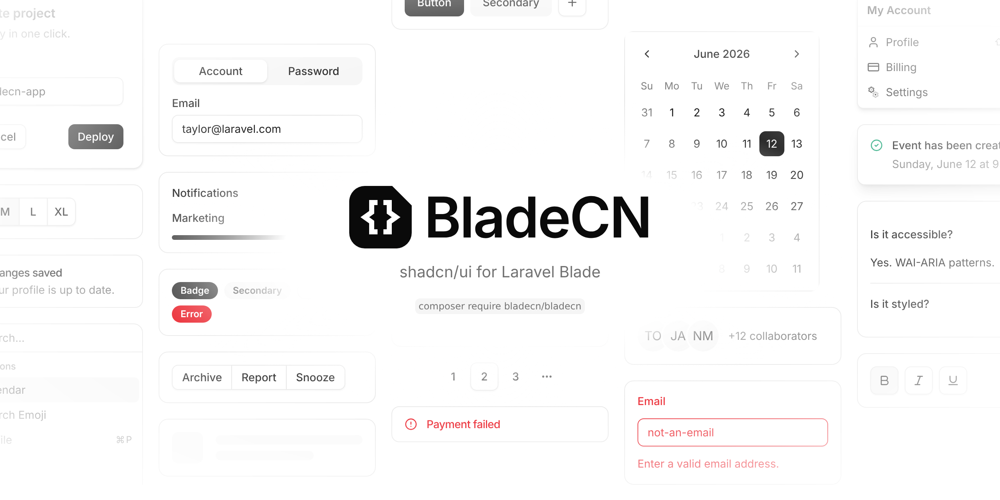

# BladeCN

A set of beautifully designed Blade components for Laravel that you can customize, extend, and build on. Inspired by shadcn/ui, built with Tailwind CSS and Alpine.js. Open Source. Open Code.

<picture>
  <source media="(prefers-color-scheme: dark)" srcset=".github/images/hero-dark.png">
  
</picture>

## Documentation

Visit https://tharinduwijayarathna.github.io/bladecn/ to view the documentation.

## Contributing

Please read the [contributing guide](./CONTRIBUTING.md).

## License

Licensed under the [MIT license](./LICENSE.md).
