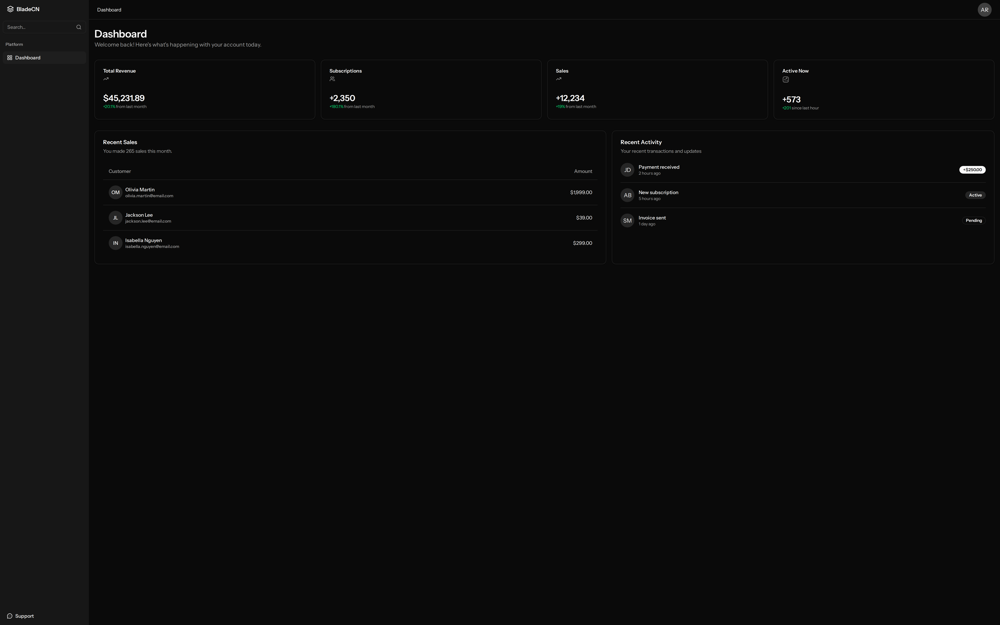
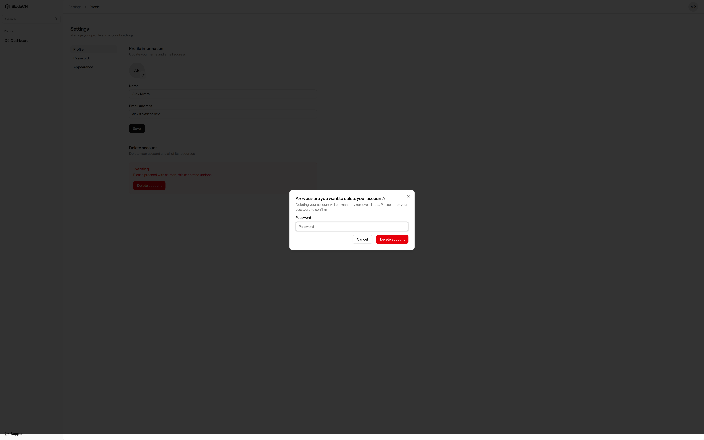

# BladeCN

**shadcn for Laravel Blade.** No React. No Livewire.

[](https://packagist.org/packages/bladecn/bladecn)
[](https://packagist.org/packages/bladecn/bladecn)

BladeCN is a starter kit (login, register, password reset, dashboard and profile) plus a shadcn-style Blade component set on Alpine and Tailwind 4.

### 📚 [Documentation →](https://tharinduwijayarathna.github.io/bladecn/)

Every component with live previews, copyable code, variants and props tables, plus installation, theming, dark mode and layouts.






## Installation

```bash
composer require bladecn/bladecn
php artisan bladecn:install
```

```bash
npm install tailwindcss @tailwindcss/vite tailwindcss-animate alpinejs @alpinejs/focus
npm run build
```

Full setup (Vite, layout stacks, configuration): [Installation](https://tharinduwijayarathna.github.io/bladecn/installation).

## Usage

```blade
<x-ui.card>
    <x-ui.card-header>
        <x-ui.card-title>Welcome</x-ui.card-title>
    </x-ui.card-header>
    <x-ui.card-content>
        <x-ui.button variant="outline">Get started</x-ui.button>
    </x-ui.card-content>
</x-ui.card>
```

Browse all [components](https://tharinduwijayarathna.github.io/bladecn/components/button), [layouts](https://tharinduwijayarathna.github.io/bladecn/layouts) and [theming](https://tharinduwijayarathna.github.io/bladecn/theming) in the docs.

### Run the docs locally

```bash
composer install && npm install
npm run docs:build
vendor/bin/testbench serve   # http://127.0.0.1:8000/docs
```

See [`workbench/README.md`](workbench/README.md) for how the docs site works.

## Requirements

- PHP 8.3 or higher
- Laravel 10.x, 11.x, or 12.x
- Tailwind CSS 4.x

## Contributing

We welcome contributions! Please see our [Contributing Guide](CONTRIBUTING.md) for details.

## License

BladeCN is open-sourced software licensed under the [MIT license](LICENSE.md).

## Credits

BladeCN is inspired by [shadcn/ui](https://ui.shadcn.com) and built for the Laravel ecosystem.
